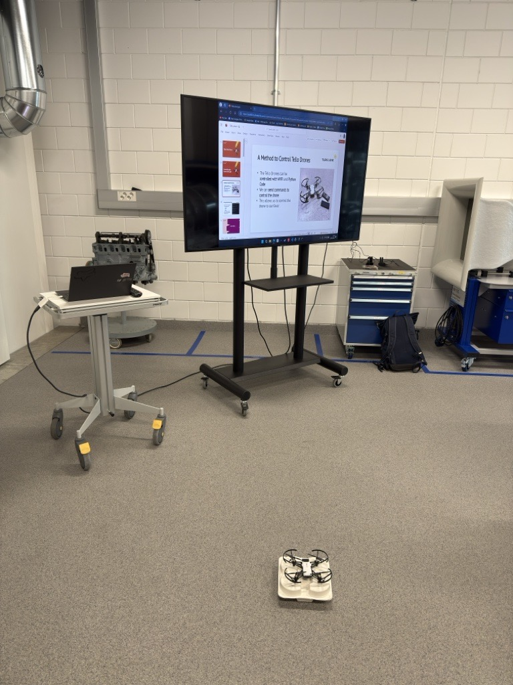

# Tello Drone Demos

***Disclamer***

Some of the code is contributed from:
- Google AI Studio model "Gemini 2.5 Pro Preview 03-25"

## Introduction

#### Why this project started?

We got a call from the machine technology project manager to demonstrate Tello drones for lower and upper school students visiting TUAS premises. At first we were asked to demo any type of robotic related project but we asked to change it to the Tello drones.

#### What is the Tello drone?

The Tello drone is a programmable drone that can be controlled with an official Tello App or can be programmed with Python, by using the Tello SDK.

#### How we achived our goal?

Firstly, we planned what to present for our guests and create an outline of our presentation. We had some ideas for using Matlab and performing choreographs with two drones, but we have decided to do something simpler. We have used the official Tello app to fly the drone, learn its functionalities and include some screenshots in the presentation. Later, with the help of Gemini, we have created a simple Python script with a few actions, such as lift off, going up by 110cm, doing a front and back flips and then landing. To achieve it, we have used the SDK manual that contains all available commands. 

## Demo day

### Day 1

In this demo day middle school students were divided into two groups. We first presented flying the drone with the code, which lift-off the drone, flipped it twice, and then landed. Then, we demonstrated how to fly the drone with the app and told some pre-cautions first. From our perspective the visitors had fun flying the drones and we have thought of doing the exact same scenario on the next demo day. 

### Day 2

In the demo day 2, we had high school students visiting our school and labs. Since this demo day had more allocated time per visit, we added one more code demo of a drone flying with the camera view and letting the visitors fly the drones themselves. In this day we faced some technical issues where the code demo did not work so we had to adapt and overcome it. After resolving the issue, we were able to demonstrate the python code, and we explained how to fly the drone with the app. From there, we let the visitors fly on their own, with one of us supervising. Most of our guests had fun to fly the drone. We had some troubles with the drones as some of them crashed causing one drone to malfunction, and some propellers to be damaged, but anyway every guest was able to fly the drone.

## Mistakes learned

In all the demonstrations we had some connectivity problems between the drones and the app. We didn't have any contingency plan for such scenario, so we had trouble of knowing what to do at this point, and we had to improvise. If we would have done this again, we would do some contingency plan to counter any issues if they would happen. 